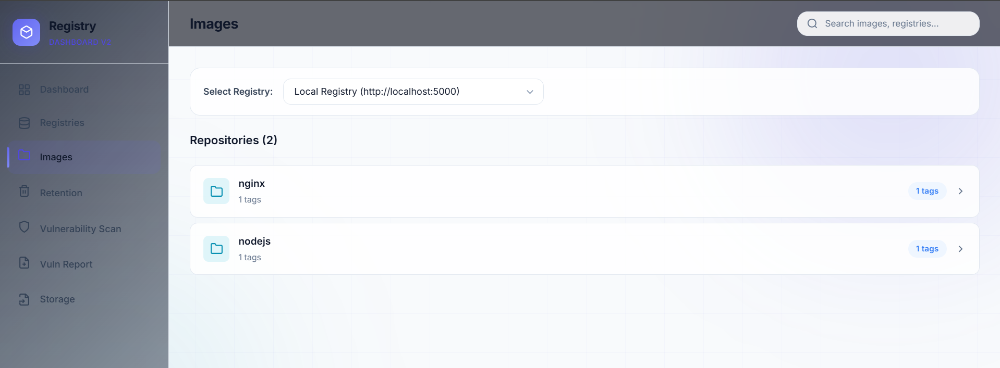
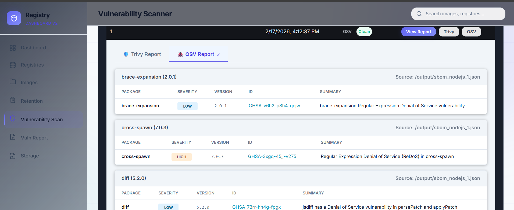
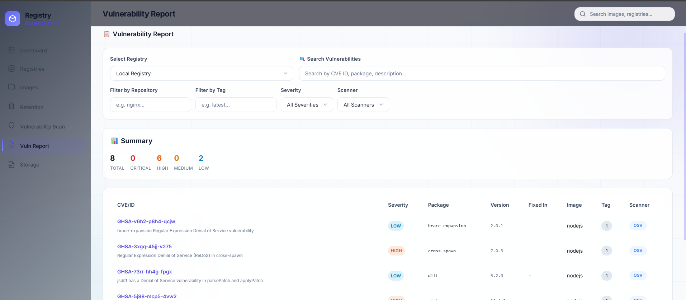
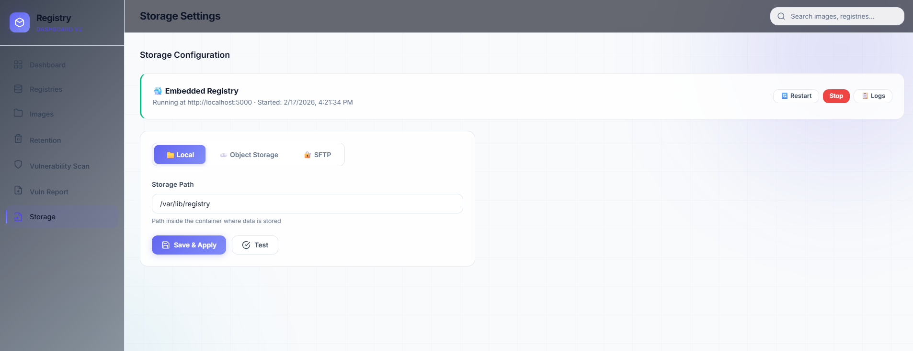

# Docker Registry Dashboard Manager

A modern, feature-rich dashboard for managing your Docker Registry V2.
Ideally suited for private registry management, providing a user-friendly interface for browsing images, managing storage, and automating cleanup.

## 🚀 Key Features

*   **Registry Management**: Add/Remove multiple registries (Local, Remote).
*   **Image Browser**: Browse repositories, tags, manifest details, and layers.
*   **Storage Configuration**: Easy setup for Filesystem, S3, or SFTP backend storage.
*   **Docker Integration**: Embedded Docker Registry V2 management (Start/Stop/Restart).
*   **Vulnerability Scanning**: Integrated security analysis with Trivy and OSV.
*   **Image Retention & Cleanup**: Automated policies to keep your registry clean.
    *   **Keep Last N Images**: Retain only the most recent builds.
    *   **Keep Time Window**: Retain images within a specific timeframe.
    *   **Whitelist Protection**: Regex-based protection for important tags (e.g. `latest`, `stable`).
    *   **Shared Digest Safety**: Smart deletion prevents removing images used by protected tags.

## 🛠️ Installation & Usage

### Prerequisites
*   Docker installed and running.
*   Go 1.22+ (if building from source).

### Running Pre-built Binary
Assuming you have `registry-dashboard.exe`:
```bash
./registry-dashboard.exe -port 8080
```
Access the dashboard at `http://localhost:8080`.

### Building from Source
```bash
go mod tidy
go build -o registry-dashboard.exe .
./registry-dashboard.exe
```

---

# 📸 Interface Guide & Gallery

The following section provides a walkthrough of the management interface.

## 📂 1. Image Repository Management
The **Images Browser** serves as the central hub for exploring your registry contents.



- **Registry Selection**: A dynamic dropdown allows you to switch between multiple connected registries.
- **Global Search**: The header search bar provides instant filtering across repositories and tags.
- **Repository List**: Displays a clean, card-based layout for each repository.

## 🧹 2. Intelligent Retention Policies
Automate the cleanup of old or unused images to save storage costs.


- **Cleanup Logic**: Set "Keep Last N" or age-based limits.
- **Advanced Filtering**: Use Regex patterns (e.g., `^latest$`) to protect critical tags from deletion.
- **Execution Status**: Real-time tracking of the "Last Run" timestamp.

## 🛡️ 3. Vulnerability Scanning Results
Deep security analysis for individual image tags using industry-standard scanners.



- **Dual-Scanner Integration**: View results from both **Trivy** and **OSV** in a unified tabbed interface.
- **Severity Badges**: Color-coded categorization for quick prioritization of security fixes.
- **Direct Links**: Clickable IDs that link directly to the official security advisory databases.

## 📊 4. Global Security Insights
A high-level dashboard for security officers to assess the health of the entire registry.



- **Aggregated Summary**: Bold counters showing the total findings categorized by severity.
- **Multidimensional Filters**: Search by CVE ID, Package, or Repository across the entire registry.

## ⚙️ 5. Storage & Registry Control
Manage the underlying infrastructure and the lifecycle of the embedded registry.



- **Lifecycle Management**: Dedicated buttons to **Start**, **Stop**, or **Restart** the registry.
- **Flexible Storage Backends**: Support for Local, S3-compatible cloud storage, and SFTP.

---

## 📝 License
MIT License.
